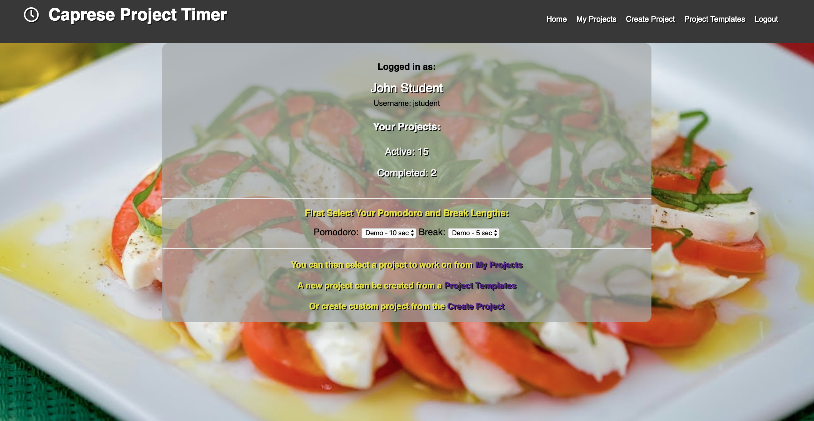
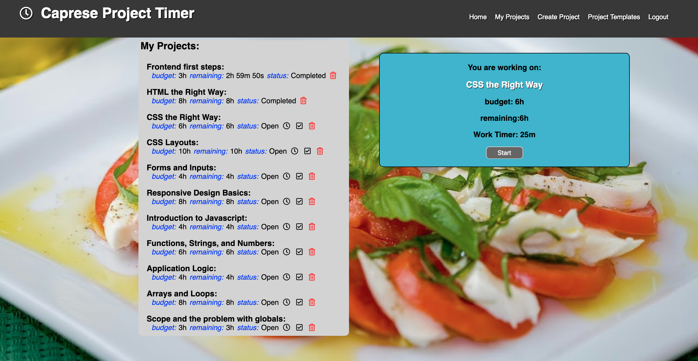
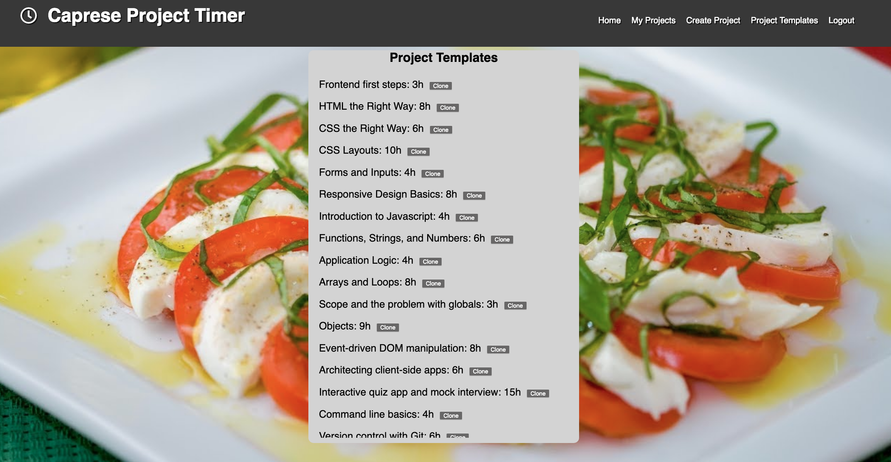

The Caprese App
====================================
Project and Pomodoro Timer...more than just a tomato timer.
------------------------------------
link: https://pacific-harbor-60678.herokuapp.com/

Background:
The idea for the Caprese app came from my experiments with various pomodoro timer apps while working on 
the Thinkful Flexible Fullstack program.  As I worked through each section I would try to keep track of 
how much time I spend on each unit and compare it to the targeted time.  Ultimately, this proved difficult
to do and found myself wishing there was an integration between a pomodoro and a project/task timer. 
The Caprese App is the basic implementation of the functionality that I sought.

test username: jstudent
password: 1qazxsw23e

Dashboard
---------
Below is a screenshot of the user's dashboard showing active and completed projects as well as a form for selecting
the pomodoro (work period) and break time lengths. For demonstration purposes the defaults are set to 10 seconds and 
5 seconds, respectively.

My Projects
------------

Project Templates
------------------
